# 🏥 Medis HMS — Hospital Management System

A full-stack Hospital Management System built with **Spring Boot 3.5** (backend) and **React + Vite + Material UI** (frontend), following **Hexagonal (Ports & Adapters)** architecture. Covers user authentication, doctor and patient management, appointment booking, medicine catalogue, and inventory tracking — all secured with JWT and cached with Redis.

---

## 📸 Screenshots

### 🔐 Authentication
| Login | Change Password |
|-------|----------------|
| 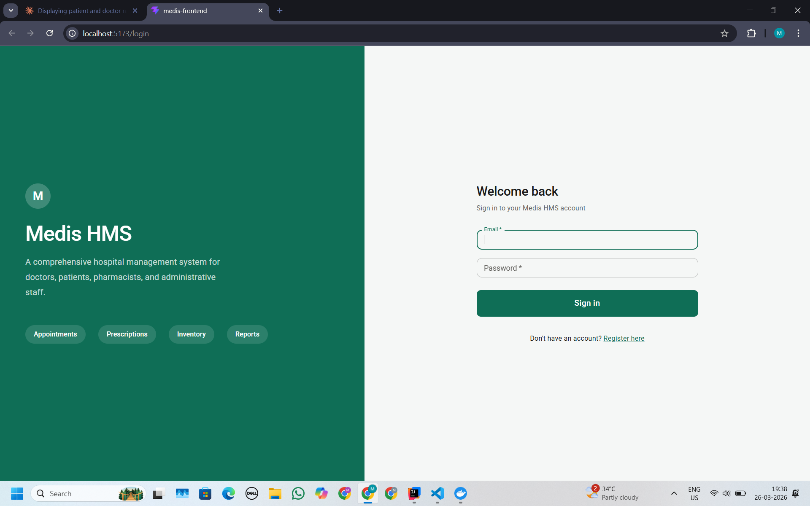 | 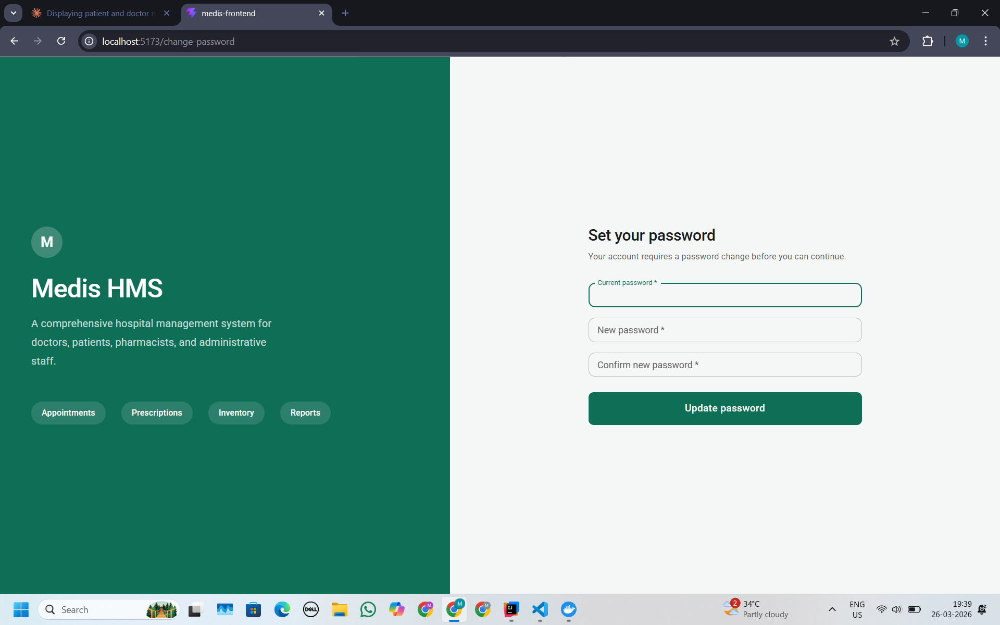 |

---

### 🧑‍⚕️ Dashboards
| Admin | Doctor | Receptionist | Pharmacist | Patient |
|-------|--------|--------------|------------|---------|
| 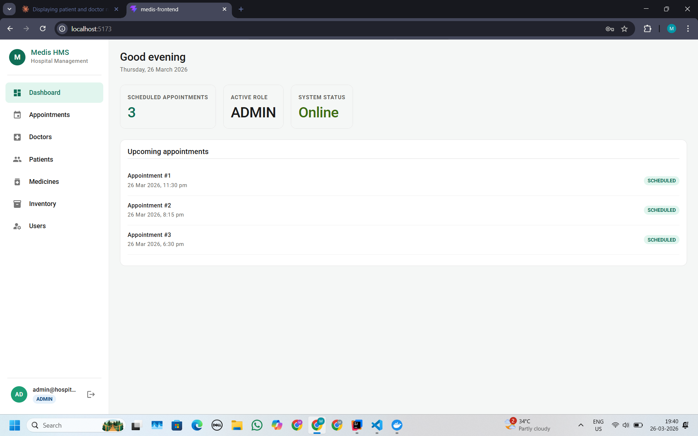 | 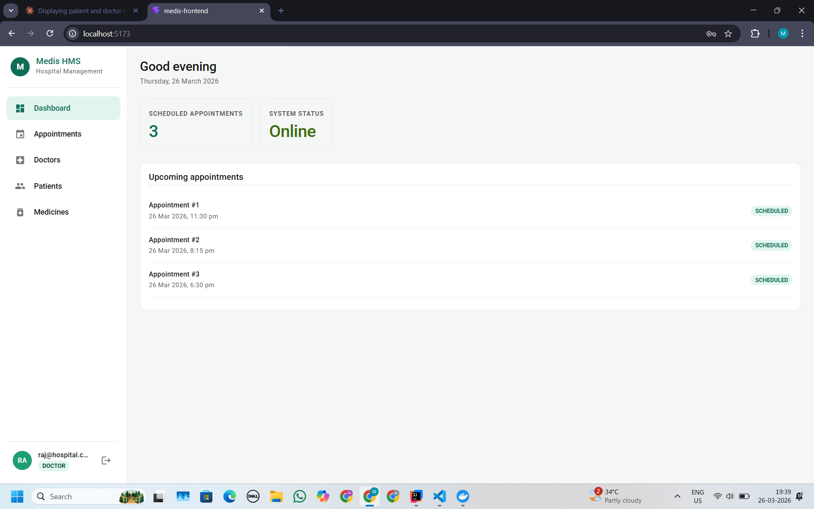 | 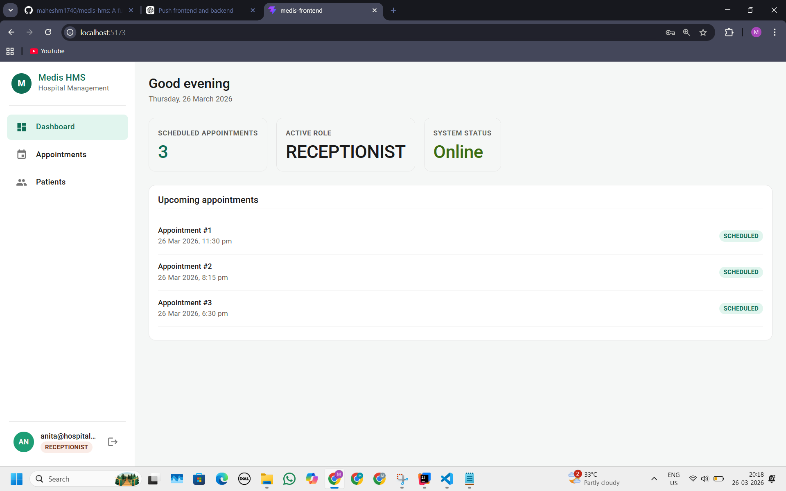 | 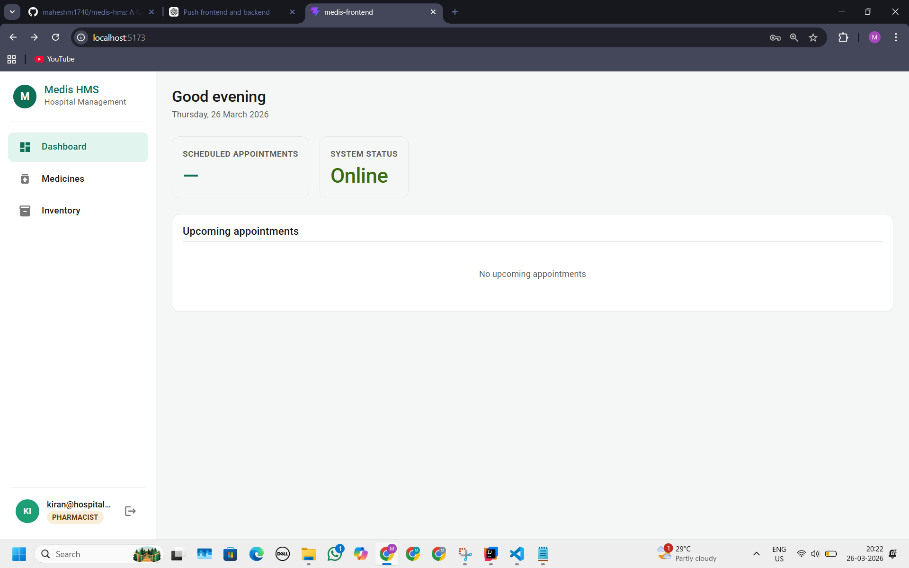 | 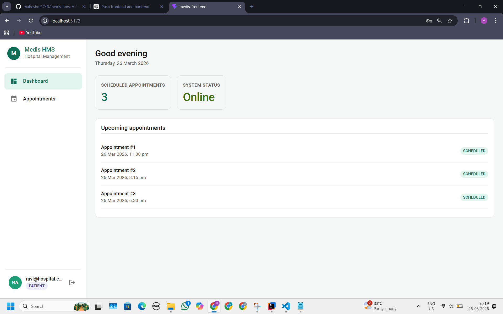 |

---

### 📋 Core Modules
| Appointments | Doctors | Patients |
|--------------|--------|----------|
| 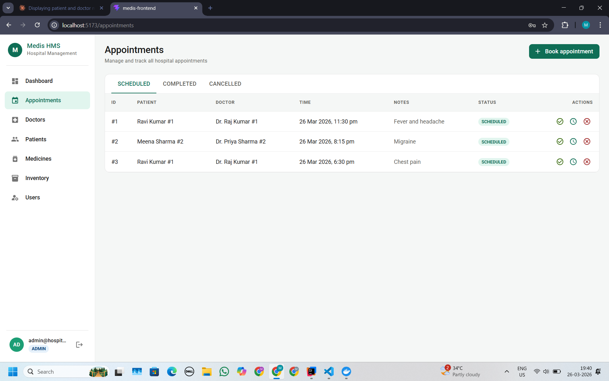 | 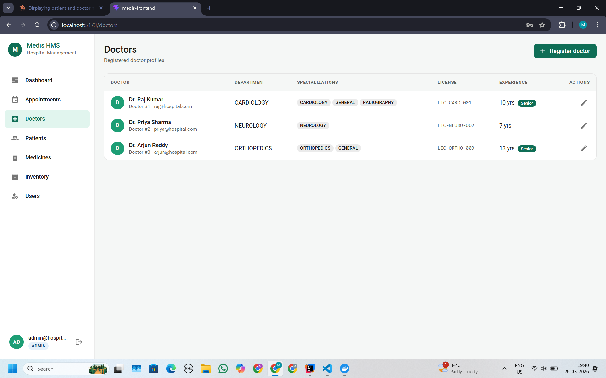 | 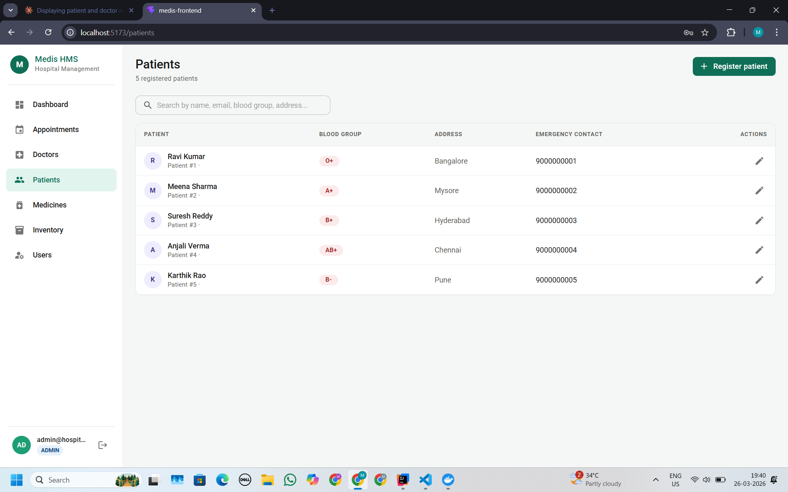 |

| Medicines | Inventory | Users |
|-----------|-----------|-------|
| 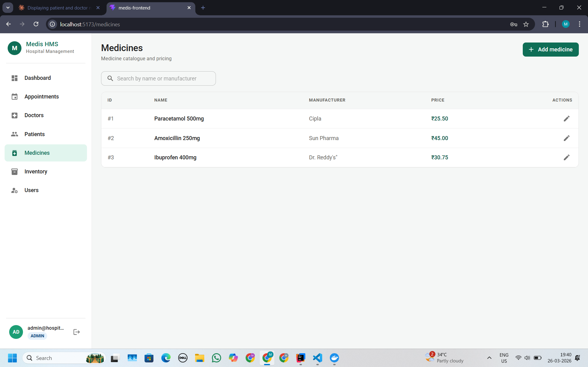 | 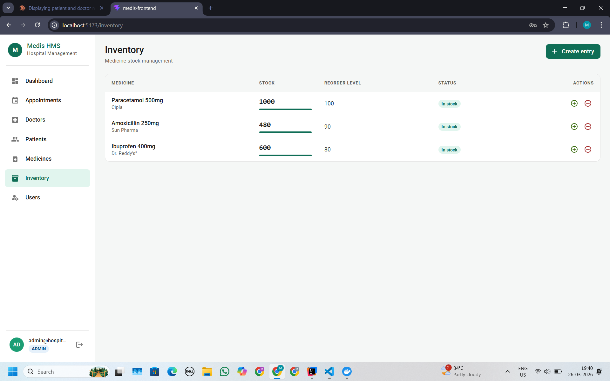 | 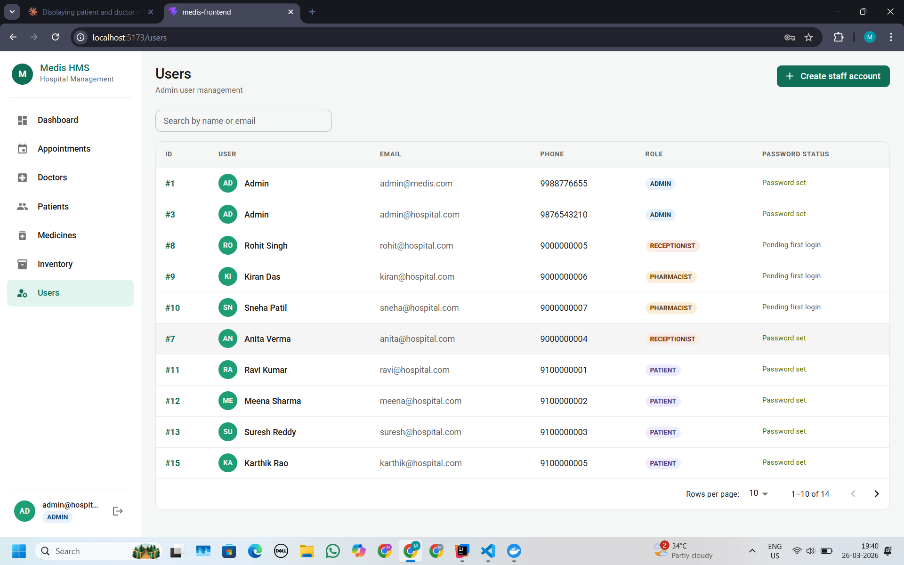 |
## 🧱 Tech Stack

### Backend
| Layer | Technology |
|---|---|
| Language | Java 21 |
| Framework | Spring Boot 3.5.11 |
| Architecture | Hexagonal (Ports & Adapters) |
| Database | PostgreSQL |
| Cache | Redis (Lettuce client) |
| ORM | Spring Data JPA / Hibernate |
| Security | Spring Security + JWT (jjwt 0.12.6) |
| API Docs | SpringDoc OpenAPI 2.8 (Swagger UI) |
| Build | Maven (mvnw wrapper) |
| Test DB | H2 in-memory |
| Test Cache | Embedded Redis (ozimov 0.7.3) |

### Frontend
| Layer | Technology |
|---|---|
| Language | JavaScript (ES2022) |
| Framework | React 18 |
| Build Tool | Vite |
| UI Library | Material UI (MUI) v5 |
| Routing | React Router v6 |
| HTTP Client | Axios |
| State | React hooks (useState, useEffect) |

---

## 👥 Roles & Permissions

| Role | Access |
|------|--------|
| `ADMIN` | Full access — users, doctors, patients, appointments, medicines, inventory |
| `DOCTOR` | Own appointments, patient records, doctors list, medicines |
| `RECEPTIONIST` | Appointments and patients (read & write) |
| `PHARMACIST` | Medicines and inventory only |
| `PATIENT` | Own appointments and profile only |

---

## ✨ Features

- **JWT Authentication** — Login with access token (24h) + refresh token (7d); forced password change on first login for admin-created staff accounts
- **Role-based UI** — Sidebar navigation and action buttons adapt dynamically based on the logged-in user's role
- **Dashboard** — Shows scheduled appointment count, active role badge, system status, and upcoming appointments list
- **Appointments** — Book, reschedule, complete, and cancel; tabbed view for Scheduled / Completed / Cancelled; displays patient and doctor names
- **Doctors** — Register with specializations (multi-tag chips), department, license number, experience years, and seniority badge
- **Patients** — Register with blood group, address, and emergency contact; searchable by name, email, blood group, or address
- **Medicines** — Catalogue with name, manufacturer, and INR pricing; searchable by name or manufacturer
- **Inventory** — Stock levels with visual progress bars, reorder level thresholds, low-stock alerts, and add/deduct stock actions
- **Users** — Admin-only; create staff accounts, view role badges and password status (set / pending first login), paginated table with search
- **Redis Caching** — Applied across all read-heavy operations with auto-eviction on mutations
- **Swagger UI** — Full interactive API documentation at `/swagger-ui.html`
- **Comprehensive Tests** — 4-layer test coverage: domain models, services, controllers, and cache integration

---

## 🏗️ Backend Architecture

```
src/main/java/com/medis/hospital_system/
├── adapters/
│   ├── in/web/
│   │   ├── controller/        # REST controllers (7)
│   │   └── dto/               # Request & response DTOs
│   └── out/persistence/
│       ├── adapter/           # Repository adapter implementations (6)
│       ├── entity/            # JPA entities (6)
│       ├── mapper/            # Entity ↔ domain mappers (6)
│       └── repository/        # Spring Data JPA repositories (6)
├── application/
│   ├── command/               # Input command objects (10)
│   ├── port/
│   │   ├── in/                # Use-case interfaces (6)
│   │   └── out/               # Repository port interfaces (6)
│   └── service/               # Business logic services (6)
├── domain/
│   ├── exception/             # Domain exceptions (4)
│   ├── model/                 # Rich domain models (6)
│   └── repository/            # Domain repository interfaces (6)
└── infrastructure/
    ├── cache/                 # Cache names + Redis config
    ├── config/                # Security, Web, Swagger config
    ├── exception/             # Global exception handler
    └── security/              # JWT filter, provider, auth service
```

---

## 💻 Frontend Structure

```
medis-frontend/
├── public/
└── src/
    ├── api/
    │   └── services.js             # Axios instances — one per resource
    │                               # (appointmentsApi, doctorsApi, patientsApi, ...)
    ├── components/
    │   └── common/                 # Shared components:
    │                               # PageHeader, StatusBadge, ConfirmDialog,
    │                               # EmptyState, ErrorMessage
    ├── hooks/
    │   └── useAuth.js              # Auth context — exposes isAdmin, isDoctor,
    │                               # isPatient, isReceptionist, user, logout
    ├── pages/
    │   ├── LoginPage.jsx           # Split-screen login with branding panel
    │   ├── ChangePasswordPage.jsx  # Forced first-login password setup
    │   ├── DashboardPage.jsx       # Stats cards + upcoming appointments
    │   ├── AppointmentsPage.jsx    # Tabbed view + book/reschedule/cancel dialogs
    │   ├── DoctorsPage.jsx         # Doctor list + register/edit dialogs
    │   ├── PatientsPage.jsx        # Patient list + register/edit dialogs
    │   ├── MedicinesPage.jsx       # Medicine catalogue + add/edit dialogs
    │   ├── InventoryPage.jsx       # Stock management + add/deduct dialogs
    │   └── UsersPage.jsx           # Admin only — staff account management
    ├── App.jsx                     # Route definitions + auth guards
    └── main.jsx
```

### Key Frontend Behaviours

**Auth Guard** — Protected routes check the JWT via `useAuth`. Unauthenticated users are redirected to `/login`. Users with `passwordChanged: false` are always redirected to `/change-password` before accessing any other route.

**Role-based rendering** — The `useAuth` hook exposes boolean flags (`isAdmin`, `isDoctor`, `isPatient`, `isReceptionist`). Pages use these to conditionally show or hide action buttons — e.g. "Book appointment" is hidden for Doctors; "Create staff account" is Admin-only; Inventory and Users pages are not shown in the sidebar for Doctors or Patients.

**API services** — All HTTP calls go through typed service functions in `src/api/services.js`, keeping pages free of raw Axios calls. Each service maps to a backend resource and handles request/response shaping.

**Dialogs** — Create and edit operations open MUI `<Dialog>` modals within the same page (no separate routes), keeping navigation minimal and focused.

**Inline actions** — Table rows include icon buttons for contextual actions (complete ✓, reschedule 🕐, cancel ✗ for appointments; add stock ⊕, deduct stock ⊖ for inventory) with a confirmation dialog before destructive operations.

---

## 🚀 Getting Started

### Prerequisites

- Java 21+
- Maven 3.9+ (or use `./mvnw`)
- PostgreSQL 14+
- Redis 6+
- Node.js 18+ & npm

---

### 🗄️ 1. Database Setup

```sql
CREATE DATABASE hospital_db;
```

---

### ⚙️ 2. Backend Setup

```bash
git clone https://github.com/your-username/medis-hms.git
cd medis-hms/hospital_system
```

Open `src/main/resources/application.yaml` and update credentials, or export environment variables:

```bash
export DB_URL=jdbc:postgresql://localhost:5432/hospital_db
export DB_USERNAME=postgres
export DB_PASSWORD=your_password
export JWT_SECRET=your-256-bit-secret-key-minimum-32-characters-long
```

> ⚠️ **Never commit real credentials.** Values in `application.yaml` are placeholders for local development only.

Start Redis:
```bash
redis-server
```

Run the backend:
```bash
./mvnw spring-boot:run
```

The API starts at **http://localhost:8080**
Swagger UI is at **http://localhost:8080/swagger-ui.html**

---

### 💻 3. Frontend Setup

```bash
cd medis-frontend
npm install
```

Create a `.env` file in the frontend root:
```env
VITE_API_BASE_URL=http://localhost:8080
```

Start the dev server:
```bash
npm run dev
```

The app runs at **http://localhost:5173**

---

## 🔌 API Reference

Base URL: `http://localhost:8080/api/v1`

All protected endpoints require: `Authorization: Bearer <accessToken>`

### Authentication

| Method | Endpoint | Auth | Description |
|---|---|---|---|
| POST | `/auth/login` | Public | Returns access + refresh tokens |
| POST | `/auth/refresh` | Public | Refresh access token |

**Login request:**
```json
{ "email": "admin@hospital.com", "password": "yourpassword" }
```

**Login response:**
```json
{
  "accessToken": "eyJ...",
  "refreshToken": "eyJ...",
  "email": "admin@hospital.com",
  "role": "ADMIN",
  "passwordChanged": true
}
```

---

### Users

| Method | Endpoint | Auth | Description |
|---|---|---|---|
| POST | `/users/register` | Public | Patient self-registration |
| POST | `/users/admin/create` | ADMIN | Create staff account (any role) |
| GET | `/users` | ADMIN | List all users |
| GET | `/users/{id}` | ADMIN | Get by ID |
| GET | `/users/by-email` | ADMIN | Get by email |
| PATCH | `/users/{id}/phone` | Authenticated | Update phone number |
| PATCH | `/users/{id}/password` | Authenticated | Change password |

---

### Doctors

| Method | Endpoint | Auth | Description |
|---|---|---|---|
| POST | `/doctors/register` | ADMIN, DOCTOR | Register doctor profile |
| GET | `/doctors/me` | DOCTOR | Get own profile |
| GET | `/doctors/{id}` | ADMIN, DOCTOR | Get by ID |
| GET | `/doctors/by-user/{userId}` | ADMIN, DOCTOR | Get by user ID |
| GET | `/doctors` | ADMIN, DOCTOR, RECEPTIONIST, PATIENT | List all |
| GET | `/doctors/by-specialization?specialization=` | ADMIN, DOCTOR | Filter by specialization |
| PATCH | `/doctors/{id}/department?department=` | ADMIN, DOCTOR | Update department |
| PATCH | `/doctors/{id}/specialization` | ADMIN, DOCTOR | Update specialization list |

---

### Patients

| Method | Endpoint | Auth | Description |
|---|---|---|---|
| POST | `/patients/register` | ADMIN, RECEPTIONIST | Register patient profile |
| GET | `/patients/me` | PATIENT | Get own profile |
| GET | `/patients/{id}` | ADMIN, DOCTOR, RECEPTIONIST | Get by ID |
| GET | `/patients/by-user/{userId}` | ADMIN, DOCTOR, RECEPTIONIST | Get by user ID |
| GET | `/patients` | ADMIN, DOCTOR, RECEPTIONIST | List all |
| PATCH | `/patients/{id}/address?address=` | ADMIN, RECEPTIONIST | Update address |
| PATCH | `/patients/{id}/emergency-contact?contact=` | ADMIN, RECEPTIONIST | Update emergency contact |

---

### Appointments

| Method | Endpoint | Auth | Description |
|---|---|---|---|
| POST | `/appointments` | ADMIN, RECEPTIONIST, PATIENT | Book appointment |
| GET | `/appointments/my` | All authenticated | Get own appointments (role-scoped by backend) |
| GET | `/appointments/by-status?status=` | All authenticated | Filter by SCHEDULED / COMPLETED / CANCELLED |
| PATCH | `/appointments/{id}/complete` | ADMIN, RECEPTIONIST, DOCTOR | Mark as completed |
| PATCH | `/appointments/{id}/cancel` | ADMIN, RECEPTIONIST, DOCTOR | Cancel |
| PATCH | `/appointments/{id}/reschedule` | ADMIN, RECEPTIONIST, DOCTOR | Reschedule |

**Book appointment request:**
```json
{
  "patientId": 1,
  "doctorId": 1,
  "appointmentTime": "2026-06-15T10:00:00",
  "notes": "Regular checkup"
}
```

---

### Medicines

| Method | Endpoint | Auth | Description |
|---|---|---|---|
| POST | `/medicines` | ADMIN, PHARMACIST | Add medicine |
| GET | `/medicines` | ADMIN, PHARMACIST, DOCTOR | List all |
| GET | `/medicines/{id}` | ADMIN, PHARMACIST, DOCTOR | Get by ID |
| GET | `/medicines/by-name?name=` | ADMIN, PHARMACIST, DOCTOR | Get by name |
| PATCH | `/medicines/{id}/price?price=` | ADMIN, PHARMACIST | Update price |
| PATCH | `/medicines/{id}/manufacturer?manufacturer=` | ADMIN, PHARMACIST | Update manufacturer |

---

### Inventory

| Method | Endpoint | Auth | Description |
|---|---|---|---|
| POST | `/inventory` | ADMIN | Create inventory entry |
| GET | `/inventory/by-medicine/{medicineId}` | ADMIN, PHARMACIST | Get stock info |
| GET | `/inventory/by-medicine/{medicineId}/low-stock` | ADMIN, PHARMACIST | Check low stock flag |
| PATCH | `/inventory/by-medicine/{medicineId}/add-stock` | ADMIN, PHARMACIST | Add stock |
| PATCH | `/inventory/by-medicine/{medicineId}/deduct-stock` | ADMIN, PHARMACIST | Deduct stock |
| PATCH | `/inventory/by-medicine/{medicineId}/reorder-level?reorderLevel=` | ADMIN, PHARMACIST | Update reorder threshold |

---

## 🔐 Authentication Flow

```
1. POST /auth/login             → access token (24h) + refresh token (7d)
2. All protected requests       → Authorization: Bearer <accessToken>
3. Token expires                → POST /auth/refresh with refreshToken
4. New access token issued      → refresh token stays the same
```

**First login for admin-created staff:** The login response includes `passwordChanged: false`. The frontend redirects these users to `/change-password` before granting access to any other page.

---

## 📦 Domain Models

### User
| Field | Type | Notes |
|---|---|---|
| id | Long | Auto-generated |
| name | String | Required |
| email | String | Unique, validated |
| password | String | BCrypt hashed |
| phone | String | Required |
| role | Role | ADMIN / DOCTOR / PATIENT / PHARMACIST / RECEPTIONIST |
| passwordChanged | boolean | `false` for admin-created accounts |

### Doctor
| Field | Type | Notes |
|---|---|---|
| id | Long | Auto-generated |
| userId | Long | FK → User |
| specialization | List\<String\> | One or more |
| department | String | Required |
| licenseNumber | String | Unique |
| experienceYears | int | ≥ 0 |

### Patient
| Field | Type | Notes |
|---|---|---|
| id | Long | Auto-generated |
| userId | Long | FK → User |
| bloodGroup | String | A+/A-/B+/B-/AB+/AB-/O+/O- |
| address | String | Required |
| emergencyContact | String | Required |

### Appointment
| Field | Type | Notes |
|---|---|---|
| id | Long | Auto-generated |
| patientId | Long | FK → Patient |
| doctorId | Long | FK → Doctor |
| appointmentTime | LocalDateTime | Must be future |
| status | AppointmentStatus | SCHEDULED → COMPLETED / CANCELLED |
| notes | String | Optional |

### Medicine
| Field | Type | Notes |
|---|---|---|
| id | Long | Auto-generated |
| name | String | Unique |
| manufacturer | String | Required |
| price | BigDecimal | ≥ 0 |

### Inventory
| Field | Type | Notes |
|---|---|---|
| id | Long | Auto-generated |
| medicineId | Long | FK → Medicine (1:1) |
| stockQuantity | int | ≥ 0 |
| reorderLevel | int | Alert threshold |

---

## 🗃️ Role Access Summary

| Resource | ADMIN | DOCTOR | PATIENT | PHARMACIST | RECEPTIONIST |
|---|:---:|:---:|:---:|:---:|:---:|
| Users (write) | ✓ | | | | |
| Doctors | ✓ | ✓ | | | |
| Patients (read) | ✓ | ✓ | | | ✓ |
| Patients (write) | ✓ | | | | ✓ |
| Appointments (book) | ✓ | | ✓ | | ✓ |
| Appointments (manage) | ✓ | ✓ | | | ✓ |
| Appointments (read) | ✓ | ✓ | ✓ | | ✓ |
| Medicines | ✓ | read | | ✓ | |
| Inventory | ✓ | | | ✓ | |

---

## ⚠️ Error Responses

All errors return a consistent JSON body:

```json
{ "message": "Human-readable error description" }
```

Validation errors return field-level detail:

```json
{ "errors": { "fieldName": "Validation message" } }
```

| HTTP Status | When |
|---|---|
| 400 Bad Request | Validation failure or invalid argument |
| 401 Unauthorized | Missing, invalid, or expired token |
| 403 Forbidden | Valid token but insufficient role |
| 404 Not Found | Resource does not exist |
| 409 Conflict | Duplicate resource or appointment conflict |
| 422 Unprocessable Entity | Insufficient stock |

---

## 🚀 Caching

Redis caching applied across all read-heavy operations:

| Cache | TTL | Contents |
|---|---|---|
| `users`, `doctors`, `patients`, `medicines` | 30 min | Single entity by ID / email |
| `doctors_all`, `medicines_all`, `doctors_by_spec` | 10 min | List queries |
| `appointments`, `appointments_by_doctor/patient/status` | 5 min | Appointment queries |
| `inventory` | 2 min | Stock levels (short TTL for accuracy) |

Mutations auto-evict affected cache entries using `@CacheEvict`, `@CachePut`, and `@Caching`.

---

## 🧪 Running Tests

```bash
# All tests
./mvnw test

# Specific test class
./mvnw test -Dtest=AppointmentServiceTest

# Skip tests (run only)
./mvnw spring-boot:run -DskipTests
```

| Layer | Classes | Framework |
|---|---|---|
| Domain model tests | 6 | JUnit 5 |
| Service unit tests | 6 | JUnit 5 + Mockito |
| Controller tests | 6 | MockMvc + WebMvcTest |
| Cache integration tests | 6 | SpringBootTest + Embedded Redis |

Tests use H2 in-memory database and embedded Redis — no external services needed.

---

## ⚙️ Configuration Reference

```yaml
spring:
  datasource:
    url: jdbc:postgresql://localhost:5432/hospital_db
    username: postgres
    password: your_password           # ← use env var in production

  jpa:
    hibernate:
      ddl-auto: update                # auto-creates/updates tables
    show-sql: true                    # disable in production

  data:
    redis:
      host: localhost
      port: 6379

jwt:
  secret: your-secret-key            # ← use env var in production (min 32 chars)
  expiration: 86400000               # 24 hours in ms
  refresh-expiration: 604800000      # 7 days in ms
```

---

## 🔧 Known Limitations

- **Appointment conflict window** is ±1 minute — should reflect actual appointment duration (e.g. 30 min)
- **Patient ownership check** missing on `GET /appointments/by-patient/{id}` — any authenticated patient can query any patient ID
- **No logout endpoint** — refresh tokens cannot be revoked (no blacklist)
- **No pagination** on `GET /doctors` and `GET /medicines` — returns full list
- **Credentials in YAML** — move `jwt.secret` and DB password to environment variables before any deployment

---

## 📄 License

This project is for educational and demonstration purposes.
